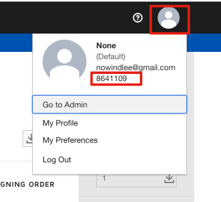
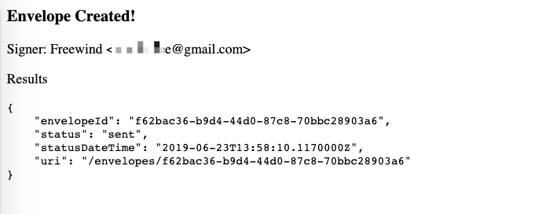
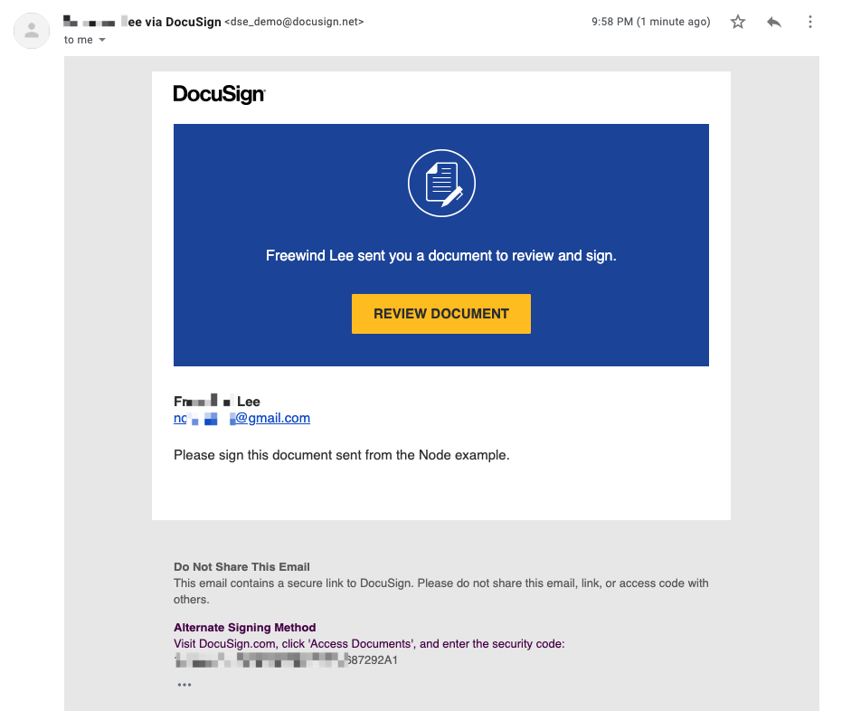
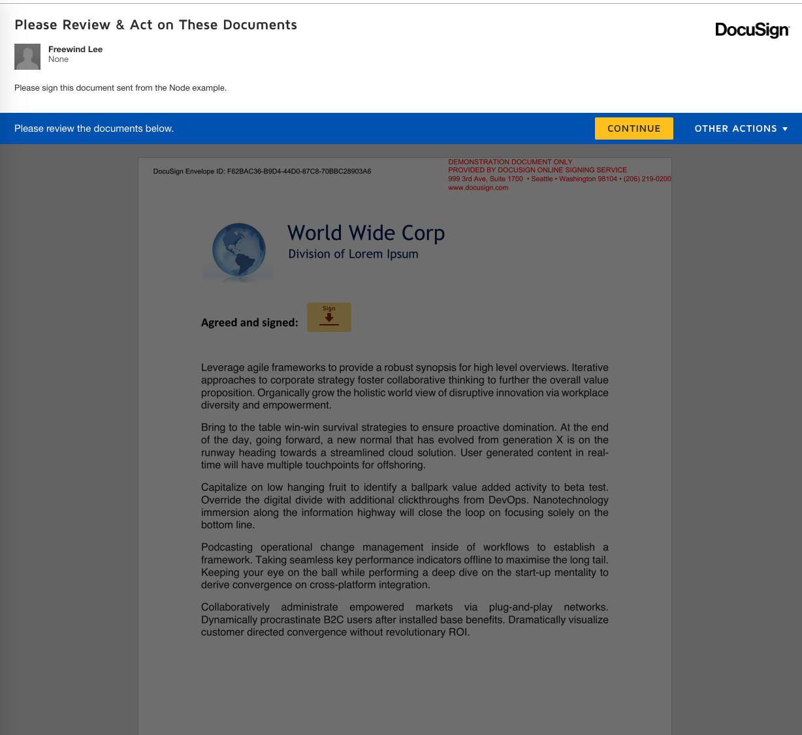

JavaScript DocuSign Email Signing Demo
=======================================

原来的文档在这里：<./ori-README.md>

```
npm install
node index.js
```

将会启动一个express服务器，可以访问http://localhost:3000

但我们需要以下四个参数：

- ACCESS_TOKEN: 登录到<https://developers.docusign.com/oauth-token-generator>可以生成一个有效期为8个小时的试用token
- ACCOUNT_ID: 开发者的docusign的accountId

  

- USER_FULLNAME: 签名者的名字
- USER_EMAIL: 签名者的Email。将把邮件发送到这个Email

准备好这些信息之后，可以打开浏览器，访问：

```
http://localhost:3000/?ACCOUNT_ID=8641109&USER_FULLNAME=Freewind&USER_EMAIL=nowindlee@gmail.com&ACCESS_TOKEN=<yourToken>
```

如果成功的话，将会看到：



签名者的邮箱会收到一封邮件：



点击REVIEW DOCUMENT后，会打开该文档签名：


